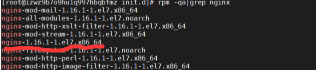

## 查看系统版本信息
```
lsb_release -a
```
我的版本信息是

## 首先关闭apache-tomcat服务
最稳妥的关闭方法，找到你的安装路径，执行bin下的shutdown脚本
```
/usr/local/backend/apache-tomcat-9.0.24/bin/shutdown.sh
```
要开启执行startup脚本
```
/usr/local/backend/apache-tomcat-9.0.24/bin/startup.sh
```
## 安装nginx
yum install nginx
安装成功后在浏览器输入服务器ip会显示欢迎页
我的是这样

# 如果你不知道yum 安装的nginx路径的话
查找nginx安装包（所有安装包都可以这样找）
```
rpm -qa|grep nginx
```

画红线的就是nginx安装包
然后查看这个安装包的安装路径
```
rpm -ql nginx-1.16.1-1.el7.x86_64
```
这个路径就是欢迎页面
```
/usr/share/nginx/html/index.html
```
你可以使用vim修改这个界面，然后去浏览器刷新一下看有没有变化

## 设置开机启动
sudo systemctl enable nginx

## 开启nginx 服务
sudo systemctl start nginx
## 重启nginx服务
sudo systemctl restart nginx
## 查看nginx状态
sudo systemctl status nginx.service

## 开启nginx服务失败的时候
报错： Job for nginx.service failed because the control process exited with error code.
意思是进程存在，解决办法
查看nginx pid  
```
ps ax | grep nginx
```
kill 掉
```
kill -9  nginx的pid
```
然后重启
service nginx start 或者 systemctl start nginx

## 开放80端口
阿里云服务器安全组规则添加80端口的出入规则

## 修改nginx 默认首页
```
vim /etc/nginx/nginx.conf
```
按 i 进入编辑模式
server {
    root 你的项目路径
}
把root的路径改为你的项目路径
改完以后按esc ， 然后按 :wq  保存并退出，重启nginx服务

