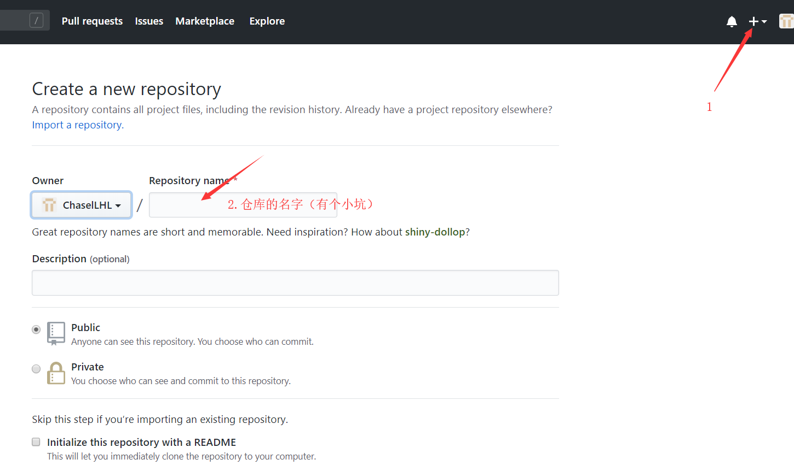
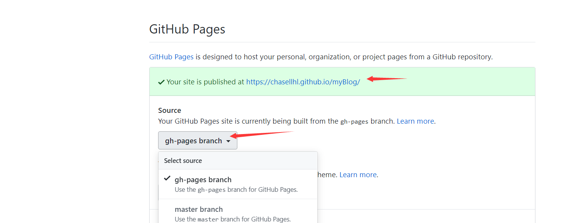

# 背景
网上搜了很多教程，包括[官网的教程](https://vuepress.vuejs.org/zh/guide/deploy.html),但是还是费了一番功夫，</br>
可能使比较笨吧，如果你使用自动化部署脚本部署不成功的话，可以参考我的这个笨方法</br>
[这是部署后的效果](https://chasellhl.github.io/myBlog/)
# 前提
我假设你本地运行OK, 已经准备好要部署了

# 第一步
你的 vuepress 项目是否已经在github上的仓库下</br>
如果是，请跳到第二步</br>
如果不是，想在GitHub新建一个仓库，如图所示：</br>

 ## 小坑
仓库名字要和config.js 里 的 base 属性值一样

比如你的仓库名字叫myBlog
base就是/myBlog/
## 1.1
创建好仓库以后，

git clone <你复制的地址>
把你的vuepress项目除了node_modules文件夹之外的文件全部复制到git clone下来的文件夹内</br>
然后npm install 或者 yarn</br>
在项目根目录新建文件.gitignore

让git 忽略  node_module下的所有文件和打包以后dist下的所有文件
## 1.2 
1. npm run docs:dev  打包/打包后的文件在docs/.vuepress/dist文件夹下
2. git add -A
3. git commit -m 'init'
4. git push

# 第二步
新切一个gh-pages(名字随意)分支并切换到该分支，执行</br>
```
git checkout -b gh-pages
```
该分支用来存打包后的文件
1. 先删除 除了.git文件夹 ， node_module文件夹 ， docs文件夹， .gitignore之外的文件
2. 再把docs/.vuepress/dist文件夹下的所有文件剪切到根目录
3. 再删除docs文件夹
4. git add -A
5. git commit -m 'deploy'
6. git push

# 第三步
此时github上你应该可以看到你的分支


点击settings ,然后往下拉，找到 GitHub Pages



在Source的下拉选中你的分支</br>
出现 Your site is published at 网址</br>
就说明发布成功了，访问这个网址就可以看到你的博客啦
