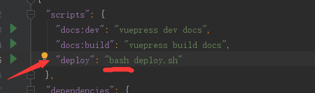

## 背景
照着[官网的教程](https://vuepress.vuejs.org/zh/guide/deploy.html)来就行了，踩了个小坑，记录一下，希望对你有帮助
[这是部署后的效果](https://chasellhl.github.io/myBlog/)
## 小坑1
如图所示，官网推荐部署命令

然而windows 没有bash 指令， 直接运行报错</br>
两个解决方法：
+ 项目根文件夹右键 gitBash here , 然后输入bash deploy.sh
+ 直接双击deploy.sh文件

## 小坑2（部分人会踩）
deploy.sh文件照官方配置没问题，但是如图所示

最后push的时候有个坑，如果你的项目是用ssh 克隆下来的就没问题，</br>
如果你是用https 克隆下来的会要求你输入用户名和密码</br>
很多新手图简单都习惯用https 克隆项目， 包括我:joy:</br>
所以，作为一个专业的coder,我们最好配一下ssh ,配置完以后重新用ssh克隆下项目，双击deploy.sh就可以自动部署了

## 番外（配置ssh）
1. 检查是否有SSH key
```
cd ~/.ssh
```
```
ls
```
2. ls是列出所有文件，看有没有id_rsa 和 id_rsa_pub
3. 如果有跳过生成密钥这一步
4. 生成密钥
```
ssh-keygen -t rsa -C "你的邮箱地址"
```
一路回车
5. 添加密钥到ssh-agent
先确保ssh-agent是有用的
```
eval "$(ssh-agent -s)"
```
添加生成的 SSH key 到 ssh-agent
```
ssh-add ~/.ssh/id_rsa
```
6. 登录github  , 点击右上角你的头像下拉的settings，点击settings里左侧菜单SSH and GPG keys
点击new SSH key按钮，把id_rsa_pub里的内容复制进去

7. 测试  
```
ssh -T git@github.com
```
如果看到Hi后面是你的用户名，就说明成功了。

8. 自己写了一个vuepress的博皮，还很简陋，欢迎试用及提出你的宝贵建议, [项目地址](https://github.com/ChaselLHL/vuepress-theme-Secondary_element)
